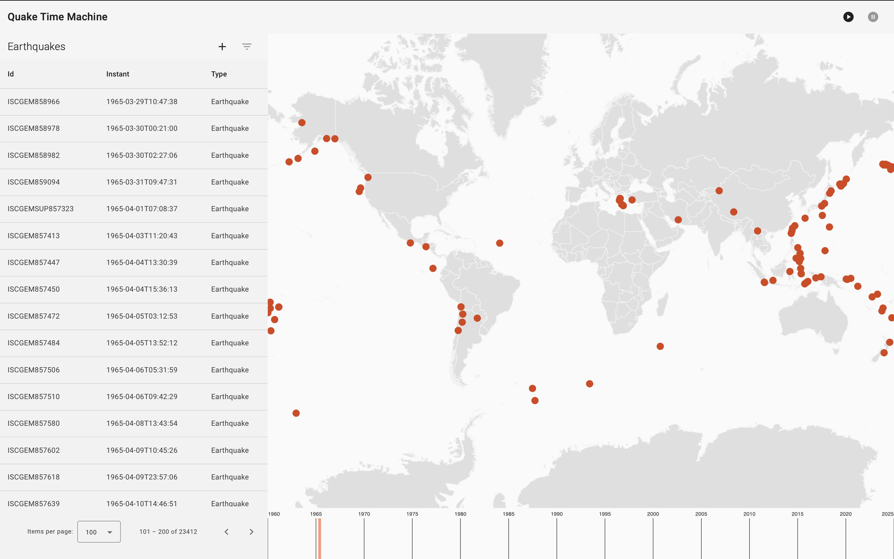

# Quake Time Machine

Quake Time Machine is a web application that provides insights into earthquake data from the last 60 years. The application offers a comprehensive set of features for visualizing earthquake information through different perspectives, including a list view, an earth map view, and a timeline.

## Features

1. Earthquake List View: The application includes a list view that displays detailed information about earthquakes. Users can perform various actions, such as selecting earthquakes for deletion, updating existing ones, or creating new earthquakes.

2. Earth Map View: Quake Time Machine offers an interactive Earth map view where earthquakes from the list are rendered as circles at their geographic locations. This feature provides users with a visual context of the earthquake occurrences on a global scale.

3. Timeline: At the bottom of the application, there is a timeline spanning the full date range of the earthquake data. An updating cursor on the timeline provides users with a dynamic visual representation of the position in time for the displayed earthquake data.

## Benefits

Quake Time Machine brings several benefits to users interested in exploring earthquake data:

1. Comprehensive Data Exploration: The application allows users to explore earthquake data from different perspectives, enabling a comprehensive understanding of the occurrences over the last 60 years.

2. Visual Context: The combination of list view, earth map view, and timeline offers users a multi-dimensional visual context for earthquake data. This approach enhances the interpretability of the information.

3. Time-Driven Analysis: With the timeline feature, users can analyze earthquake patterns and trends over time. The updating cursor provides a real-time view of the temporal distribution of earthquakes.

4. Geospatial Understanding: The earth map view provides a geospatial representation of earthquake occurrences, allowing users to observe patterns and correlations based on geographic locations.

5. Actionable Insights: Quake Time Machine empowers users with actionable insights by providing tools for updating, creating, and managing earthquake data.

## Getting Started

To get started with Quake Time Machine, follow these steps:

1. Clone the repository.
2. Build and run the POSTGRES docker image [docs](/postgres/README.md)
3. Build the frontend [docs](/frontend/README.md)
4. Run the backend [docs](/backend/README.md)

### Unfinished Features

Due to time constraints before the assignment due date, the following feature is not fully implemented:

#### Earthquake Data Clustering:

The clustering of earthquake data to display a summary using geodata of those clusters is not completed.

#### Earthquake Data Filter:

The filter of earthquake data to display a smaller set of earthquake data is not completed.
